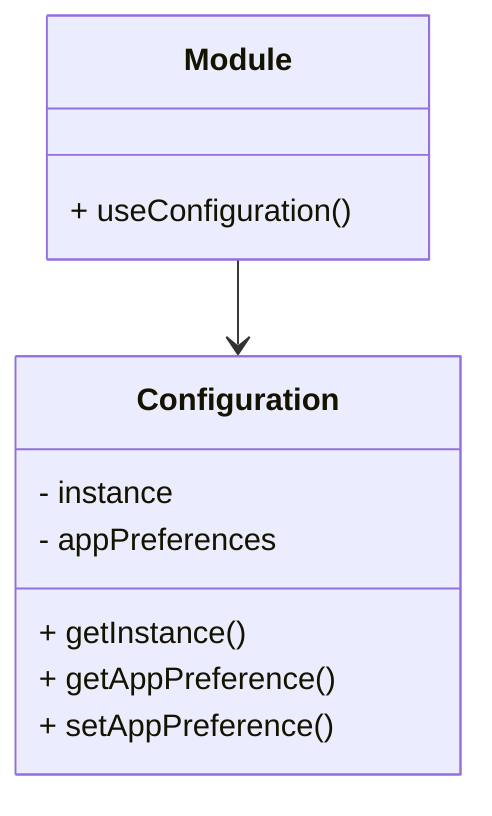

Exercice 1 : Conception (5 points)
Contexte
Une application de gestion hospitalière nécessite un système de configuration centralisé. Ce système doit :

Stocker les paramètres de connexion à la base de données
Conserver les préférences globales de l'application (langue, fuseau horaire, etc.)
Être accessible depuis n'importe quel module de l'application
Garantir que tous les modules utilisent exactement les mêmes paramètres
Le problème actuel est que différents modules créent leurs propres instances de configuration, ce qui entraîne des incohérences.

Questions
1.1 Quel pattern de conception résout ce problème ? Justifiez. (1 point)
**Réponse :**

Le pattern qui résout ce problème est le pattern Singleton. Ce pattern garrantit qu'une classe n'a qu'une seule instance ce qui évite donc les incohérences entre les modules.

1.2 Réalisez le diagramme de classes UML de votre solution EN Mermaid. (1.5 points)
**Réponse :**

# Diagramme UML - Question 1.2 :




1.3 Proposez une implémentation thread-safe dans le langage de votre choix. (2 points)
**Réponse :**

```csharp
public class Configuration
{
    private static readonly object padlock = new object();
    private static Configuration instance = null;

    public string DbConnectionString { get; set; }
    public Dictionary<string, string> AppPreferences { get; set; }

    private Configuration()
    {
        AppPreferences = new Dictionary<string, string>();
    }

    public static Configuration GetInstance()
    {
        if (instance == null)
        {
            lock (padlock)
            {
                if (instance == null)
                {
                    instance = new Configuration();
                }
            }
        }
        return instance;
    }
}
```

1.4 Quels sont les avantages et inconvénients de ce pattern ? Citez-en au moins 2 de chaque. (0.5 point)

**Réponse :**

Avantages :
 1. Contrôle d'accès à une ressource partagée : Le pattern Singleton garantit qu'une seule instance de la classe de configuration existe
 2. Réduction de la consommation de mémoire : avec une seule instance la duplication inutile des données de configuration n'est pas possible.

 Inconvénients :

 1. Difficulté de testabilité : Le pattern Singleton peut rendre les tests unitaires plus difficiles a faire.
 2. Rigidité : Le pattern Singleton peut rendre le code moins flexible et plus difficile à modifier ou à etendre.